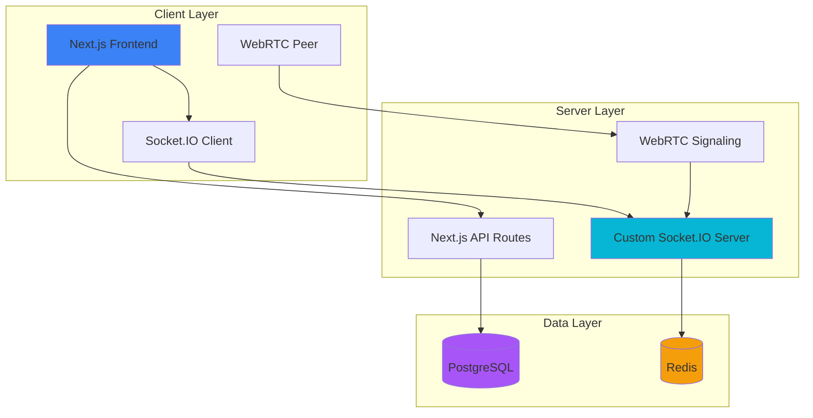
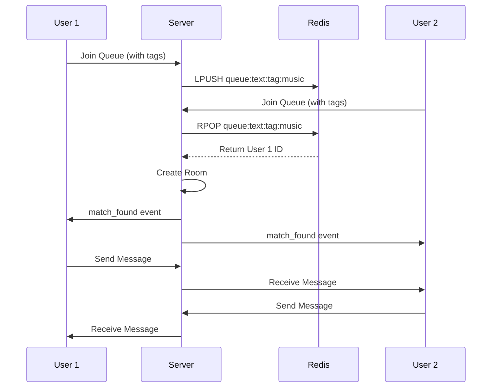

<div align="center">

# 🌐 StrangerConnect

**Anonymous Video & Text Chat Platform**

[](https://nextjs.org/)
[](https://www.typescriptlang.org/)
[](https://socket.io/)
[](https://www.docker.com/)
[](LICENSE)

[Live Demo](#) • [Documentation](docs/) • [Report Bug](../../issues) • [Request Feature](../../issues)

---

**Connect with random strangers worldwide through anonymous video and text chat.**  
Free, instant, and private conversations with interest-based matching.


</div>

---

## ✨ Features

### 🎯 Core Features

- **Anonymous Chat** - No registration required, instant connections
- **Video Chat** - WebRTC-powered high-quality video streaming
- **Text Chat** - Real-time messaging with typing indicators
- **Interest Matching** - Tag-based matching to find like-minded people
- **Report System** - Built-in moderation with screenshot capture
- **Admin Panel** - Comprehensive user and report management

### 🔐 Security & Privacy

- **IP Hashing** - SHA-256 hashed IPs for ban enforcement
- **Fingerprint Tracking** - Browser fingerprinting for ban evasion prevention
- **Rate Limiting** - Protection against spam and abuse
- **Content Filtering** - Bad word filter on messages
- **Secure Sessions** - HttpOnly cookies with CSRF protection

### ⚡ Performance

- **WebRTC Optimization** - Multiple STUN servers, trickle ICE
- **Code Splitting** - Dynamic imports, ~65% smaller bundles
- **Redis Caching** - Lightning-fast queue management
- **Database Optimization** - Prisma ORM with efficient queries

---

## 🏗️ Architecture



### Data Flow: Text Chat



### Data Flow: Video Chat

```mermaid
sequenceDiagram
    participant U1 as User 1 Browser
    participant S as Server
    participant U2 as User 2 Browser

    Note over U1,U2: Matching Phase (same as text)

    U1->>U1: Get Media (Camera/Mic)
    U2->>U2: Get Media (Camera/Mic)

    U1->>S: WebRTC Offer
    S->>U2: Forward Offer
    U2->>S: WebRTC Answer
    S->>U1: Forward Answer

    U1->>S: ICE Candidate
    S->>U2: Forward ICE
    U2->>S: ICE Candidate
    S->>U1: Forward ICE

    Note over U1,U2: P2P Connection Established
    U1<-->U2: Direct Media Stream
```

---

## 🚀 Quick Start

### Prerequisites

- Node.js 20+
- PostgreSQL 14+
- Redis 7+
- npm or yarn

### Installation

```bash
# 1. Clone the repository
git clone https://github.com/shivamsinghAIMLops32/omegle-cloning.git
cd omegle-cloning

# 2. Install dependencies
npm install

# 3. Set up environment variables
cp .env.example .env
# Edit .env with your database credentials

# 4. Run database migrations
npx prisma migrate dev

# 5. Generate Prisma Client
npx prisma generate

# 6. Start development server
npm run dev
```

Visit `http://localhost:3000` 🎉

---

## 🐳 Docker Deployment

```bash
# Build and start all services
docker-compose up -d

# Run database migrations
docker-compose exec app npx prisma migrate deploy

# View logs
docker-compose logs -f app

# Stop services
docker-compose down
```

**Services included:**

- PostgreSQL (port 5432)
- Redis (port 6379)
- Next.js App (port 3000)

---

## 📁 Project Structure

```
omegle-cloning/
├── src/
│   ├── app/                    # Next.js 14 App Router
│   │   ├── api/                # API routes
│   │   │   ├── admin/          # Admin endpoints
│   │   │   ├── auth/           # Authentication
│   │   │   └── report/         # Reporting system
│   │   ├── admin/              # Admin dashboard
│   │   ├── chat/               # Chat pages
│   │   │   ├── text/           # Text chat
│   │   │   └── video/          # Video chat
│   │   └── page.tsx            # Landing page
│   ├── components/             # React components
│   │   ├── chat/               # Chat UI components
│   │   └── ui/                 # shadcn/ui components
│   ├── lib/                    # Utilities
│   │   ├── fingerprint.ts      # User fingerprinting
│   │   ├── geolocation.ts      # IP geolocation
│   │   ├── prisma.ts           # Database client
│   │   ├── redis.ts            # Redis client
│   │   └── webrtc-config.ts    # WebRTC optimization
│   └── styles/                 # Global CSS
├── prisma/
│   └── schema.prisma           # Database schema
├── public/                     # Static assets
├── server.ts                   # Custom Socket.IO server
├── docker-compose.yml          # Docker orchestration
├── Dockerfile                  # Production image
└── next.config.js              # Next.js configuration
```

---

## 🛠️ Tech Stack

### Frontend

- **Framework:** Next.js 14 (App Router)
- **Language:** TypeScript
- **Styling:** Tailwind CSS
- **UI Library:** shadcn/ui + Radix UI
- **Icons:** Lucide React
- **Real-time:** Socket.IO Client
- **WebRTC:** Native Web APIs

### Backend

- **Runtime:** Node.js 20
- **Framework:** Next.js API Routes
- **WebSocket:** Socket.IO
- **Database:** PostgreSQL + Prisma ORM
- **Cache:** Redis (ioredis)
- **Auth:** Cookie-based sessions

### DevOps

- **Containerization:** Docker + Docker Compose
- **Reverse Proxy:** Nginx (production)
- **SSL:** Let's Encrypt
- **Monitoring:** Built-in logging

---

## 🎯 How It Works

### 1️⃣ User Connects

```typescript
// Client generates fingerprint
const fingerprint = await generateFingerprint();

// Check if banned
const response = await fetch("/api/auth/check-ban", {
  method: "POST",
  body: JSON.stringify({ fingerprintHash }),
});
```

### 2️⃣ Join Queue

```typescript
// User joins queue with optional interests
socket.emit("join_queue", {
  mode: "text", // or 'video'
  tags: ["music", "gaming", "tech"],
});
```

### 3️⃣ Matching Algorithm

```typescript
// Server matches by tags first, then general queue
for (const tag of tags) {
  partnerId = await redis.rpop(`queue:${mode}:tag:${tag}`);
  if (partnerId) break;
}
if (!partnerId) {
  partnerId = await redis.rpop(`queue:${mode}`);
}
```

### 4️⃣ Chat Session

- Text: Real-time messaging via Socket.IO
- Video: WebRTC peer-to-peer connection

### 5️⃣ Disconnect & Next

```typescript
// User can skip to next stranger
socket.emit("leave_room");
socket.emit("join_queue", { mode, tags });
```

---

## 🤝 Contributing

We love contributions! Here's how you can help:

### 🐛 Found a Bug?

1. Check if it's [already reported](../../issues)
2. If not, [create a new issue](../../issues/new)
3. Include:
   - Clear title
   - Steps to reproduce
   - Expected vs actual behavior
   - Screenshots (if applicable)

### 💡 Have a Feature Idea?

1. [Open a feature request](../../issues/new)
2. Describe:
   - The problem it solves
   - Proposed solution
   - Alternative solutions considered

### 🔧 Want to Code?

#### Step 1: Fork & Clone

```bash
# Fork the repo on GitHub, then:
git clone https://github.com/YOUR_USERNAME/omegle-cloning.git
cd omegle-cloning
git remote add upstream https://github.com/shivamsinghAIMLops32/omegle-cloning.git
```

#### Step 2: Create a Branch

```bash
git checkout -b feature/amazing-feature
# or
git checkout -b fix/bug-description
```

#### Step 3: Make Changes

```bash
# Install dependencies if needed
npm install

# Make your changes
# Write tests (if applicable)
# Ensure code quality:
npm run lint
npm run build
```

#### Step 4: Commit

```bash
git add .
git commit -m "feat: add amazing feature"
# Follow Conventional Commits: feat/fix/docs/style/refactor/test/chore
```

#### Step 5: Push & PR

```bash
git push origin feature/amazing-feature
```

Then open a Pull Request on GitHub!

### 📋 Contribution Guidelines

- **Code Style:** Follow existing TypeScript/React patterns
- **Commits:** Use [Conventional Commits](https://www.conventionalcommits.org/)
- **Testing:** Add tests for new features (when applicable)
- **Documentation:** Update README if adding features
- **PRs:** Keep them focused (one feature/fix per PR)

### 🎨 Areas We Need Help

- [ ] UI/UX improvements
- [ ] Mobile app (React Native)
- [ ] Additional language support (i18n)
- [ ] Performance optimizations
- [ ] Test coverage
- [ ] Documentation improvements

---

## 🔒 Security

### Reporting Vulnerabilities

**Do NOT open public issues for security vulnerabilities!**

Instead, email: [your-email@example.com]

Include:

- Description of the vulnerability
- Steps to reproduce
- Potential impact
- Suggested fix (if any)

We'll respond within 48 hours.

### Security Features

- ✅ IP hashing (SHA-256)
- ✅ Fingerprint-based ban evasion prevention
- ✅ Rate limiting (API + WebSocket)
- ✅ Content filtering
- ✅ HTTPS-only in production
- ✅ HttpOnly cookies
- ✅ CSRF protection

---

## 📊 Performance Benchmarks

| Metric                    | Value            |
| ------------------------- | ---------------- |
| First Load JS             | ~500KB (gzipped) |
| WebRTC Connection Time    | 0.5-1s           |
| Message Latency           | <50ms            |
| Concurrent Users (tested) | 1000+            |
| Database Queries          | <10ms avg        |
| Redis Operations          | <5ms avg         |

---

## 🗺️ Roadmap

### ✅ Completed (v1.0)

- [x] Text chat with interest matching
- [x] Video chat with WebRTC
- [x] Admin panel
- [x] Ban system
- [x] Report system
- [x] Docker deployment

### 🚧 In Progress

- [ ] Mobile responsive improvements
- [ ] TURN server integration
- [ ] Enhanced analytics

### 🔮 Future (v2.0)

- [ ] Group chat rooms
- [ ] End-to-end encryption
- [ ] Mobile apps (iOS/Android)
- [ ] Multi-language support
- [ ] Voice-only mode
- [ ] Screen sharing

---

## 📝 License

This project is licensed under the MIT License - see the [LICENSE](LICENSE) file for details.

---

## 🙏 Acknowledgments

- [Next.js](https://nextjs.org/) - The React Framework
- [Socket.IO](https://socket.io/) - Real-time communication
- [Prisma](https://www.prisma.io/) - Modern database toolkit
- [shadcn/ui](https://ui.shadcn.com/) - Beautiful UI components
- [Tailwind CSS](https://tailwindcss.com/) - Utility-first CSS

---

## 📞 Support

Need help? Here's how to reach us:

- 📧 Email: [your-email@example.com]
- 💬 Discussions: [GitHub Discussions](../../discussions)
- 🐛 Issues: [GitHub Issues](../../issues)
- 🐦 Twitter: [@yourusername]

---

## 📈 Stats


---

<div align="center">

**Made with ❤️ by [shivamsinghAIMLops32](https://github.com/shivamsinghAIMLops32)**

If you found this project helpful, consider giving it a ⭐!

[⬆ Back to Top](#-strangerconnect)

</div>
